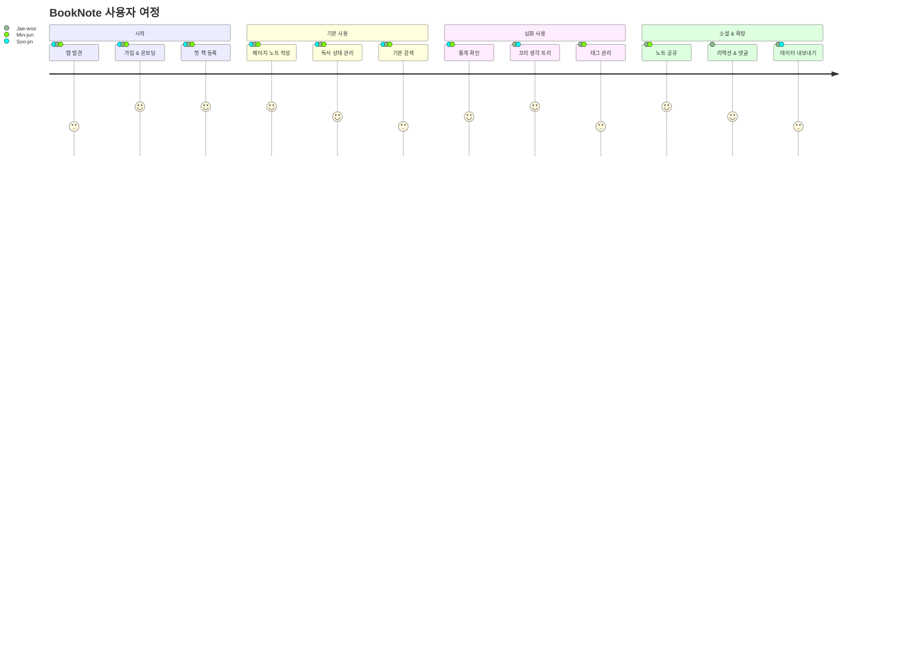
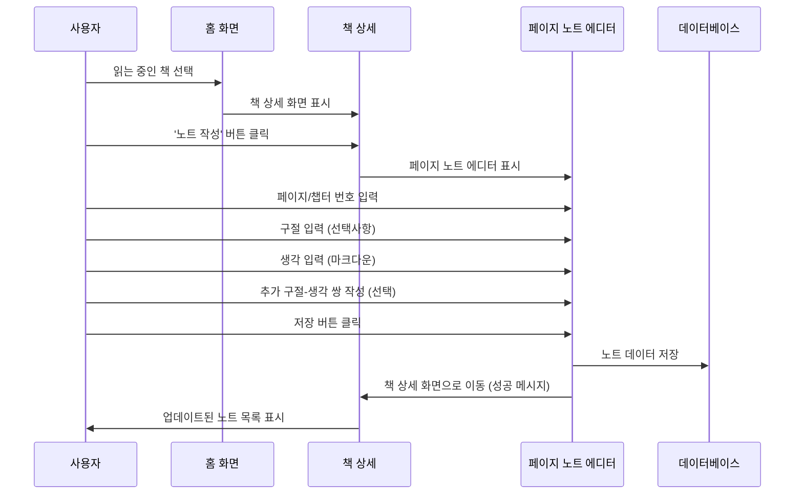
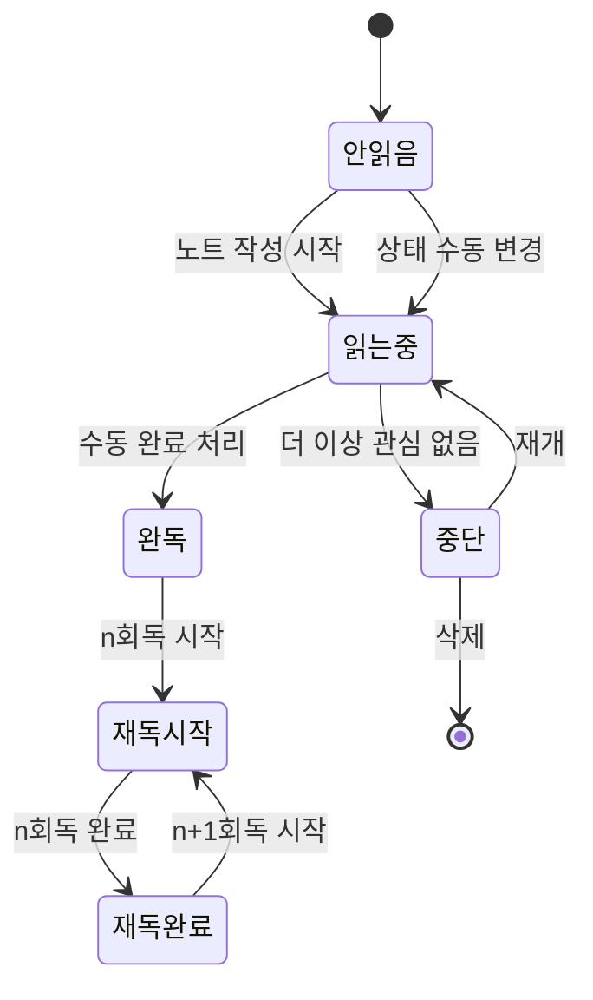
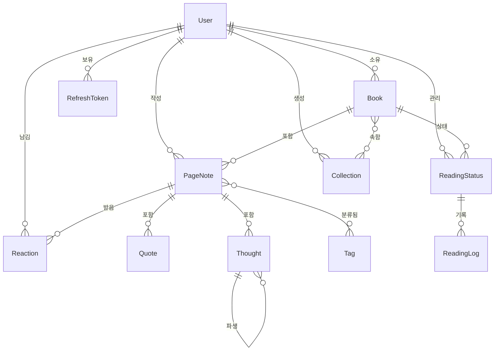
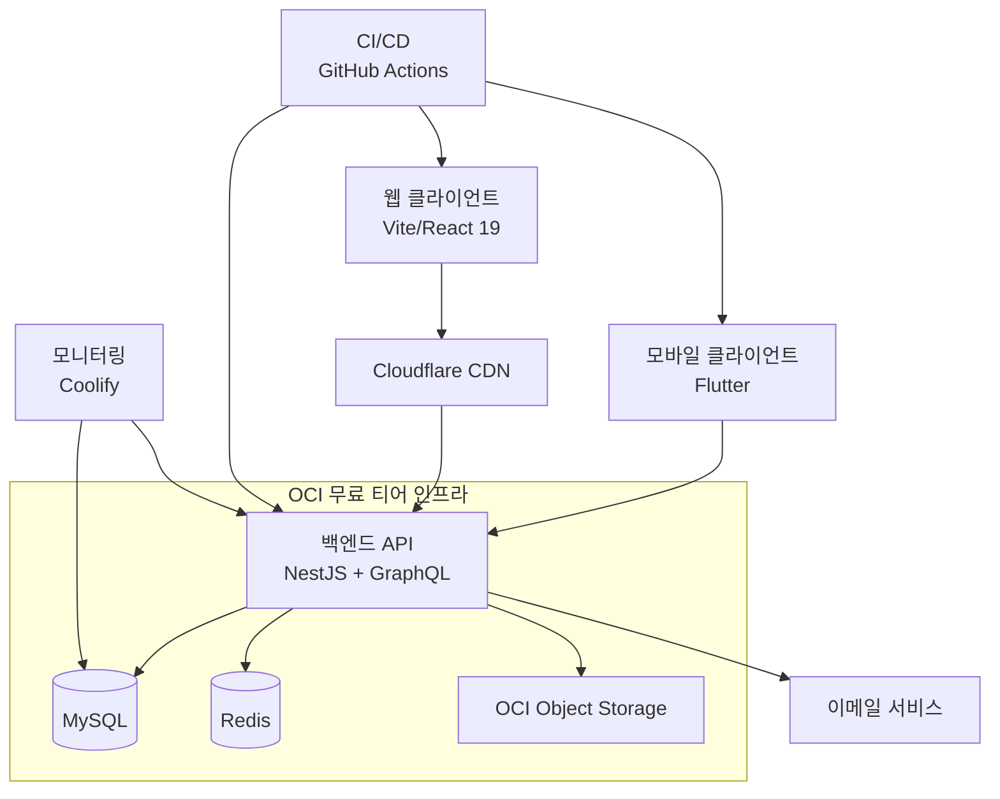
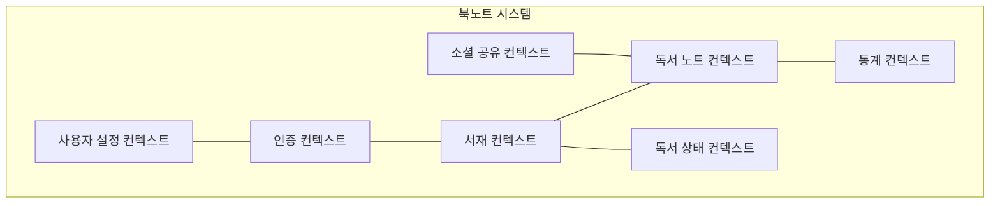
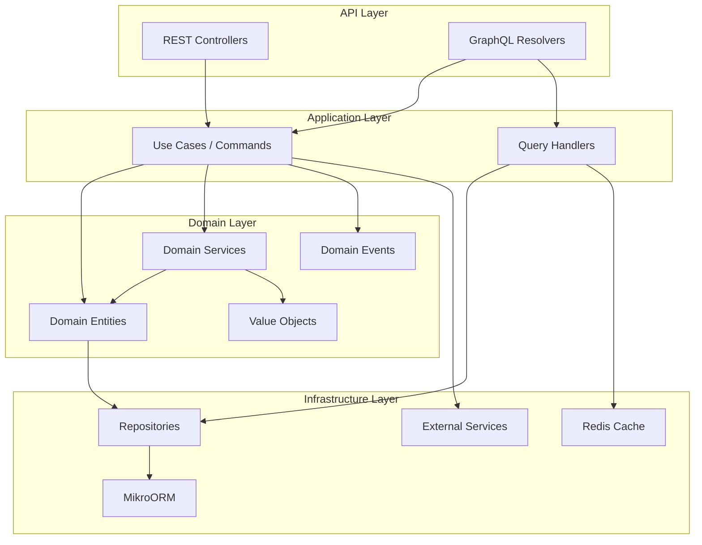
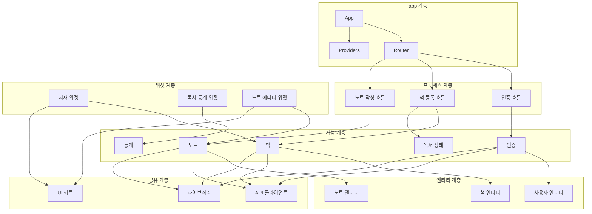
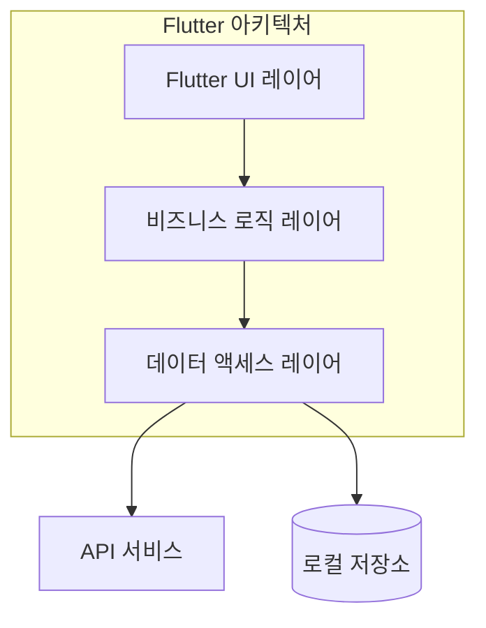

# 📚 **BookNote** – 개인 독서 기록 · 감상 서비스 확장 PRD · Tech Spec · 디자인

> **라이선스** : Creative Commons Attribution‑NonCommercial‑NoDerivatives 4.0 (CC BY‑NC‑ND 4.0)

## 목차

1. [소개](#1-소개)
2. [제품 비전 & KPI](#2-제품-비전--kpi)
3. [페르소나 & 사용자 여정](#3-페르소나--사용자-여정)
4. [사용자 경험 & UI/UX 상세화](#4-사용자-경험--uiux-상세화)
5. [기능 요구 사항](#5-기능-요구-사항)
6. [비기능 요구 사항](#6-비기능-요구-사항)
7. [도메인 모델 & 데이터 설계](#7-도메인-모델--데이터-설계)
8. [시스템 아키텍처](#8-시스템-아키텍처)
9. [백엔드 (NestJS + GraphQL) 스펙](#9-백엔드-nestjs--graphql-스펙)
10. [프론트엔드 아키텍처](#10-프론트엔드-아키텍처)
11. [모바일 앱 설계](#11-모바일-앱-설계)
12. [보안 & 컴플라이언스](#12-보안--컴플라이언스)
13. [DevOps · 인프라 (OCI + Coolify)](#13-devops--인프라-oci--coolify)
14. [테스트 전략](#14-테스트-전략)
15. [프로젝트 관리 & 로드맵](#15-프로젝트-관리--로드맵)
16. [부록](#16-부록)

---

## 1. 소개

**BookNote**는 *모든 종류의 책*을 읽으며 떠오른 생각·구절을 **페이지/챕터 단위로 구조화**해 기록하고, 언제든 검색·재독·분석할 수 있게 해주는 1인용 독서 매니저입니다.

### 1.1 제품 배경 및 설립 동기

많은 독서가들이 책을 읽는 과정에서 중요한 구절에 밑줄을 긋거나 메모를 남기지만, 이러한 귀중한 기록들은 시간이 지나면 잊히거나 접근하기 어려워집니다. BookNote는 이 문제를 해결하기 위해 독서 중 떠오른 생각과 발견한 구절을 체계적으로 기록하고 후속 활용이 가능하도록 하는 디지털 솔루션을 제공합니다.

### 1.2 제품 개요 및 차별점

BookNote는 단순한 독서 기록 앱을 넘어서, 구조화된 노트 시스템을 통해 책의 정보를 더 깊이 이해하고 오래 기억할 수 있도록 설계되었습니다:

- **페이지/챕터 중심 구조화**: 책의 물리적 구조(페이지, 챕터)를 기반으로 노트를 작성하여 컨텍스트 유지
- **구절-생각 연결**: 책 속 구절과 자신의 생각을 연결하여 의미 있는 기록 생성
- **계층적 사고 기록**: 하나의 아이디어에서 파생되는 '꼬리 생각'을 트리 구조로 기록 가능
- **검색 및 재발견**: 과거 기록을 쉽게 검색하고 재발견할 수 있는 강력한 검색 기능

---

## 2. 제품 비전 & KPI

### 2.1 비전 및 미션

- **비전**: "모든 독서가의 생각을 체계화하고 확장시키는 가장 신뢰받는 독서 도구"
- **미션**: "독서의 순간을 의미 있게 기록하고, 지식을 구조화하여 개인의 지적 성장을 가속화합니다"

### 2.2 목표 및 성과 지표

| 구분               | 내용                                                                              |
| ---------------- | --------------------------------------------------------------------------------- |
| **1년 비전**        | "독서 기록 앱 Top 3 (국내) – 적극 사용자 ≥ 20K"                                            |
| **북극성 지표**       | 월간 '페이지 노트' 생성 수                                                                |
| **1차 지표**        | 사용자당 월평균 앱 사용 일수, 월간 활성 사용자(MAU), 주간 활성 사용자(WAU), 페이지 노트당 평균 생각(Thought) 수        |
| **2차 지표**        | ARPU(유료 전환율), 앱 설치 > 가입 전환율, 리텐션(D+1/7/14/30/60/90)                           |
| **MVP 지표 (3개월)** | Retention D+30 ≥ 40% / 주간 노트 ≥ 2개 사용자 비율 ≥ 50%                                  |

### 2.3 제품 성장 계획

| 단계           | 기간    | 목표 사용자 수 | 주요 성과 지표                       | 핵심 기능                             |
| ------------ | ------- | ---------- | -------------------------------- | ---------------------------------- |
| **알파 테스트**   | 2M     | 100       | 주요 기능 완성도 90%, 중대 버그 < 3개        | 책 등록, 페이지 노트, 독서 상태                |
| **클로즈드 베타**  | 3M     | 500       | Retention D+14 ≥ 35%, 기능 만족도 ≥ 4.0 | 기본 검색, 통계 대시보드, 독서 달력              |
| **퍼블릭 베타**   | 3M     | 5,000     | Retention D+30 ≥ 40%, 앱 안정성 99.5%  | 고급 검색, 첫 소셜 기능, 데이터 익스포트            |
| **정식 출시**    | 6M+    | 20,000    | MAU 10K, WAU/MAU ≥ 0.5           | 프리미엄 구독, 독서 인사이트, 소셜 리액션 확장         |

---

## 3. 페르소나 & 사용자 여정

### 3.1 주요 페르소나 상세

#### 3.1.1 Soo-jin (30세, 직장인 독서가)

| 구분          | 상세 내용                                                                                 |
| ----------- | --------------------------------------------------------------------------------------- |
| **배경**      | 출판/미디어 회사 마케터, 월 4권 목표, 커리어 및 자기계발 독서 집중                                               |
| **목표**      | 독서를 통한 인사이트 추출 및 업무 적용, 지속적인 독서 습관 형성                                                  |
| **문제점**     | 기존 노트 앱은 구조화가 어렵고, 종이 메모는 나중에 찾기 힘듦                                                     |
| **Needs**   | 읽으면서 떠오른 아이디어를 구조화·검색, 꾸준한 독서 동기부여                                                     |
| **행동 패턴**   | 출퇴근 시간 독서, 주말 카페에서 집중 독서, 메모 습관 보유                                                     |
| **디바이스**    | 아이폰, 아이패드, 맥북                                                                         |
| **성공 지표**   | 월 목표 독서량 달성, 업무에 적용 가능한 아이디어 발굴, 독서 노트 재활용 빈도 ↑                                        |

#### 3.1.2 Jae-woo (25세, 대학원생 & 독서모임 운영)

| 구분          | 상세 내용                                                                               |
| ----------- | ------------------------------------------------------------------------------------- |
| **배경**      | 인문학 대학원생, 월 6-8권 독서, 교내 독서모임 운영                                                   |
| **목표**      | 논문 작성을 위한 체계적인 독서 기록, 모임 멤버와 효과적인 독서 내용 공유                                         |
| **문제점**     | 인용할 내용을 나중에 찾기 힘들고, 모임 멤버와 공유할 때 컨텍스트가 유실됨                                        |
| **Needs**   | 멤버에게 읽은 부분·인사이트 공유, 페이지 단위 인용 관리, 논문 작성 시 검색                                       |
| **행동 패턴**   | 도서관에서 집중 독서, 디지털 도구 활용에 능숙, 심층적 토론 선호                                             |
| **디바이스**    | 안드로이드 폰, 윈도우 노트북                                                                   |
| **성공 지표**   | 모임 참여율·논의 깊이 ↑, 논문 작성 시 인용 활용도 증가                                                 |

#### 3.1.3 Min-jun (45세, IT 매니저 & 취미 독서가)

| 구분          | 상세 내용                                                                            |
| ----------- | ---------------------------------------------------------------------------------- |
| **배경**      | IT 부서 관리자, 월 2-3권 독서, 리더십/SF/역사 선호                                              |
| **목표**      | 지식 확장, 팀원들에게 책 추천 및 배움 공유                                                        |
| **문제점**     | 과거에 읽은 내용을 기억하기 어렵고, 책의 핵심 내용만 빠르게 복습하기 어려움                                     |
| **Needs**   | 독서 히스토리 관리, 주요 인사이트 요약, 팀원들과 선택적 공유                                              |
| **행동 패턴**   | 주말 독서, 휴가 중 집중 독서, 오디오북 병행                                                      |
| **디바이스**    | 아이폰, 아이패드                                                                        |
| **성공 지표**   | 자기계발 도서 인사이트 업무 적용, 팀원 독서 참여 증가                                                 |

### 3.2 사용자 여정 지도

#### 3.2.1 Soo-jin의 여정: "업무 인사이트를 위한 체계적 독서"

| 단계                | 행동 및 터치포인트                                 | 생각 및 감정                          | 기회 및 개선점                          |
| ----------------- | ------------------------------------------ | --------------------------------- | ---------------------------------- |
| **발견**            | 앱스토어 검색, 독서 커뮤니티 추천                        | "구조화된 독서 기록 앱을 찾고 있어"             | ASO 최적화, 인플루언서 마케팅                 |
| **온보딩**           | 앱 다운로드, 가입, 튜토리얼                           | "사용법이 간단해 보이고 UI가 깔끔하네"           | 첫 책 등록 시 보상, 샘플 노트 제공               |
| **첫 책 등록**        | ISBN 스캔, 책 정보 확인                           | "와, 정보가 자동으로 불러와지네!"              | 최근 베스트셀러 빠른 검색 추가                 |
| **첫 페이지 노트 작성**   | 페이지 입력, 구절 인용, 생각 기록                       | "생각을 구조화하기 좋은데 좀 더 쉽게 할 수 없을까?"     | 음성-텍스트 변환 옵션, 빠른 템플릿                |
| **독서 상태 관리**      | 읽는 중 → 완독 상태 변경                           | "책을 끝내고 전체 리뷰를 남기고 싶은데..."        | 완독 축하 및 리뷰 작성 프롬프트                 |
| **검색 및 통계 확인**    | 키워드 검색, 월간 독서 통계 확인                       | "내가 이렇게 많은 노트를 썼었나? 뿌듯하다!"        | 인사이트 요약 제공, 성취감 시각화                |
| **재독 및 리뷰**       | 이전 노트 확인, 추가 생각 기록                        | "전에 놓쳤던 부분을 이제 발견했네"              | 시간에 따른 생각 변화 트래킹                   |
| **공유 및 확장**       | 특정 노트를 동료에게 공유                            | "이 인사이트를 팀에 바로 적용해 볼 수 있을 것 같아"    | 선택적 공유 권한, 협업 노트 기능                 |

#### 3.2.2 Jae-woo의 여정: "독서모임 활성화 및 논문 작성"

| 단계                | 행동 및 터치포인트                                 | 생각 및 감정                          | 기회 및 개선점                          |
| ----------------- | ------------------------------------------ | --------------------------------- | ---------------------------------- |
| **발견**            | 친구 추천, 학술 커뮤니티 리뷰                          | "논문 작성에 도움이 될까?"                  | 학술용 사용 사례 마케팅                     |
| **온보딩**           | 웹 버전으로 시작, 계정 생성                           | "노트북에서도 사용할 수 있어 좋네"              | 크로스 플랫폼 동기화 강조                    |
| **독서 모임 설정**      | 읽을 책 등록, 일정 계획                            | "모임원들과 어떻게 노트를 공유할까?"             | 그룹 기능, 독서 진행률 공유                   |
| **깊이 있는 노트 작성**   | 챕터별 핵심 구절 기록, 꼬리 생각 트리 활용                 | "생각의 연결고리를 시각화할 수 있어 좋아!"         | 사고 맵핑, 관계 시각화 기능                   |
| **모임 전 공유**       | 주요 노트 선택적 공유, 논의 주제 표시                    | "이 부분에 대해 집중적으로 이야기해 보고 싶어"       | 공동 어노테이션, 댓글 기능                   |
| **모임 중 활용**       | 실시간 노트 참조, 추가 기록                          | "토론하며 새로운 관점을 바로 기록할 수 있어 유용해"     | 실시간 공동 편집, 오프라인 모드                 |
| **논문 작성 활용**      | 태그 검색, 인용 내용 추출                           | "필요한 인용구를 정확히 찾을 수 있어 시간이 절약돼"    | 인용 포맷 자동 변환, 학술 데이터베이스 연동          |
| **장기 아카이브**      | 학기별/주제별 독서 기록 정리                          | "축적된 지식이 체계적으로 정리되니 가치가 더 커지는 것 같아" | 지식 그래프, 연결 관계 발견 기능                |

### 3.3 사용자 스토리맵



---

## 4. 사용자 경험 & UI/UX 상세화

### 4.1 디자인 철학 및 원칙

BookNote의 사용자 인터페이스는 다음 핵심 원칙을 따릅니다:

1. **단순성과 집중**: 독서와 기록에 집중할 수 있는 깔끔한 UI
2. **구조화된 유연성**: 체계적이면서도 사용자 맞춤형 기록 가능
3. **컨텍스트 유지**: 책-페이지-구절-생각의 연결성 유지
4. **발견 가능성**: 과거 기록을 쉽게 재발견할 수 있는 검색 및 필터링
5. **일관된 크로스 플랫폼**: 모든 디바이스에서 일관된 경험 제공

### 4.2 핵심 화면 및 사용자 플로우

#### 4.2.1 홈 대시보드

**목적**: 사용자의 독서 활동 개요와 빠른 액세스 제공

**주요 요소**:
- 현재 읽는 책 (최대 3권) 카로셀
- 최근 페이지 노트 (시간순)
- 이번 주/월 독서 통계 요약 (목표 대비 진행률)
- 빠른 액션 버튼 (책 추가, 노트 작성, 검색)

**상호작용**:
- 책 표지 탭 → 해당 책 상세 페이지로 이동
- 최근 노트 탭 → 해당 노트 편집 모드로 이동
- 통계 카드 탭 → 상세 통계 페이지로 이동
- 플로팅 액션 버튼(FAB) → 빠른 액션 메뉴 (책 추가, 노트 작성)

#### 4.2.2 책 상세 페이지

**목적**: 특정 책에 대한 모든 정보와 노트를 중앙 집중화

**주요 요소**:
- 책 정보 헤더 (표지, 제목, 저자, 출판사)
- 독서 상태 관리 (안 읽음/읽는 중/완독/재독)
- 페이지/챕터별 노트 목록 (정렬: 페이지순/시간순)
- 책 통계 (페이지 노트 수, 구절 수, 생각 수)
- 전체 리뷰 섹션 (완독 후 활성화)

**상호작용**:
- 상태 변경 → 드롭다운 메뉴에서 선택 (상태 변경 히스토리 기록)
- 페이지 노트 탭 → 해당 노트 상세/편집
- '+' 버튼 → 새 페이지 노트 작성
- 메타데이터 편집 아이콘 → 책 정보 편집 모달

#### 4.2.3 페이지 노트 작성/편집

**목적**: 특정 페이지/챕터에 대한 구절과 생각을 구조화하여 기록

**주요 요소**:
- 페이지/챕터 입력 필드 (숫자 또는 텍스트)
- 구절-생각 쌍 컨테이너 (여러 개 추가 가능)
- 마크다운 편집기 (텍스트 서식)
- 꼬리 생각 트리 (계층적 생각 기록)
- 태그 입력 필드

**상호작용**:
- 구절 추가 버튼 → 새 구절-생각 쌍 추가
- 생각 확장 버튼 → 꼬리 생각 추가 (들여쓰기로 표시)
- 저장 버튼 → 노트 저장 및 책 상세 페이지로 이동
- 태그 추가 → 자동완성 지원 (기존 태그)

#### 4.2.4 검색 및 필터

**목적**: 사용자의 모든 독서 노트에서 정보를 빠르게 찾고 필터링

**주요 요소**:
- 통합 검색 바
- 필터 패널 (책/날짜/태그/상태)
- 검색 결과 목록 (구절/생각 프리뷰)
- 검색 결과 컨텍스트 (책 제목, 페이지)

**상호작용**:
- 고급 검색 토글 → 필터 패널 표시/숨김
- 결과 항목 탭 → 원본 컨텍스트로 이동 (책 > 페이지 노트)
- 필터 적용 → 실시간 결과 업데이트
- 검색 히스토리 → 최근 검색어 제안

#### 4.2.5 통계 및 인사이트

**목적**: 사용자의 독서 습관과 노트 패턴을 시각화

**주요 요소**:
- 독서량 추이 차트 (일/주/월/년)
- 히트맵 캘린더 (독서 활동 표시)
- 태그 클라우드 (자주 사용하는 태그)
- 책별/저자별 통계 (노트 수, 평균 깊이)
- 독서 목표 추적기

**상호작용**:
- 기간 선택 드롭다운 → 차트 기간 변경
- 히트맵 날짜 탭 → 해당 일의 활동 상세
- 태그 클릭 → 해당 태그 노트 필터링
- 목표 편집 → 목표 설정/수정 모달

### 4.3 주요 인터랙션 패턴

#### 4.3.1 페이지 노트 작성 흐름



#### 4.3.2 꼬리 생각 트리 활용

```mermaid
graph TD
    A[구절: "지식의 가치는..."] --> B[생각: 지식은 적용될 때 가치가 있다]
    B --> C[꼬리생각 1: 회사 프로젝트에 이 개념 적용 가능]
    B --> D[꼬리생각 2: 지식과 지혜의 차이점]
    C --> E[꼬리생각 1-1: 팀 미팅에서 공유할 포인트]
    D --> F[꼬리생각 2-1: 관련 철학 도서 찾아보기]
```

#### 4.3.3 독서 상태 라이프사이클



### 4.4 모바일 최적화 UX

1. **하단 탭 네비게이션**: 핵심 기능에 빠르게 접근 (홈, 서재, 검색, 통계, 프로필)
2. **스와이프 제스처**: 노트 간 이동, 빠른 액션 접근
3. **오프라인 모드**: 인터넷 연결 없이 기본 기능 사용 가능
4. **분할 화면 지원**: 태블릿에서 e북과 동시 사용 최적화
5. **다크 모드**: 야간 독서 시 눈의 피로 감소

### 4.5 접근성 고려사항

1. **대체 텍스트**: 모든 이미지에 스크린 리더 대체 텍스트 제공
2. **키보드 내비게이션**: 모든 기능을 키보드만으로 사용 가능
3. **색상 대비**: WCAG 2.1 AA 기준 준수 (4.5:1 이상)
4. **텍스트 크기 조절**: 사용자 설정에 따른 유동적 텍스트 크기
5. **음성 입력**: 구절 및 생각 음성 입력 지원 (모바일 우선)
6. **햅틱 피드백**: 중요 액션 수행 시 진동 피드백 (설정 가능)

---

## 5. 기능 요구 사항

### 5.1 핵심 기능 상세

| Epic        | User Story                       | 주요 AC                                                    | 우선순위   | MVP |
| ----------- | -------------------------------- | --------------------------------------------------------- | -------- | --- |
| **책 등록**    | "ISBN으로 책 정보를 자동으로 불러오고 싶다"     | • Naver Book API 검색<br>• 중복 ISBN 차단<br>• 구매 정보 옵션<br>• 수동 입력 폴백   | 높음      | ⬤   |
|             | "책 표지를 촬영하여 등록하고 싶다"           | • 표지 이미지 인식<br>• AI 도서 정보 검색<br>• 결과 확인 및 수정                | 중간      |     |
|             | "내 서재에 책을 폴더/컬렉션으로 정리하고 싶다"   | • 사용자 정의 컬렉션<br>• 한 책의 다중 컬렉션 소속<br>• 컬렉션 색상 커스텀      | 낮음      |     |
| **페이지 노트**  | "p.34 구절 + 내 생각을 남기고 싶다"       | • [구절, 생각] 세트 N개<br>• 꼬리 생각 트리<br>• **Markdown(텍스트 전용)**      | 높음      | ⬤   |
|             | "내 생각에 이어지는 새로운 생각을 트리로 기록하고 싶다" | • 최대 3단계 중첩<br>• 시각적 들여쓰기<br>• 접기/펼치기 기능                  | 높음      | ⬤   |
|             | "챕터 기반으로 노트를 구성하고 싶다"         | • 페이지 번호 대신 챕터명<br>• 챕터 내 섹션 구분<br>• 자동 목차 추출            | 중간      |     |
|             | "노트에 태그를 추가하고 싶다"             | • 다중 태그 지원<br>• 자동 완성<br>• 태그 관리 인터페이스                     | 중간      |     |
| **독서 상태**   | "읽는 중·완독·재독 횟수를 관리하고 싶다"      | • 상태 enum<br>• n회독 자동 증가·수정<br>• 상태 변경 히스토리                | 높음      | ⬤   |
|             | "독서 목표를 설정하고 추적하고 싶다"         | • 기간별 목표(주/월/년)<br>• 시각적 진행 바<br>• 목표 달성 알림               | 중간      |     |
|             | "독서 달력으로 습관을 확인하고 싶다"         | • 히트맵 캘린더<br>• 일일 활동 요약<br>• 연속 독서일 스트릭                   | 중간      |     |
| **통계 / 검색** | "지난달 가장 많이 인용한 책을 보고 싶다"      | • 날짜·책별 Heatmap<br>• 필터 검색<br>• 데이터 시각화                     | 중간      |     |
|             | "내 독서 패턴을 분석하고 싶다"            | • 시간대별 활동<br>• 장르별 분포<br>• 노트 작성 패턴                        | 낮음      |     |
|             | "특정 키워드나 개념이 포함된 모든 노트를 찾고 싶다" | • 전체 텍스트 검색<br>• 컨텍스트 프리뷰<br>• 관련성 정렬                     | 높음      |     |
| **소셜 리액션**  | "친구 노트에 👍 이모지를 달고 싶다"        | • 이모지 / 좋아요<br>• ACL (보기·편집)<br>• 알림                        | 낮음      |     |
|             | "특정 노트를 링크로 공유하고 싶다"          | • 공유 링크 생성<br>• 접근 권한 설정<br>• 임베드 지원                        | 낮음      |     |
|             | "내 독서 활동을 주간 뉴스레터로 받고 싶다"     | • 주간 활동 요약<br>• 노트 하이라이트<br>• 맞춤 독서 제안                     | 낮음      |     |
| **데이터 관리**  | "내 노트를 마크다운으로 내보내고 싶다"       | • 책별/전체 내보내기<br>• 마크다운/PDF 포맷<br>• 메타데이터 포함                | 중간      |     |
|             | "클라우드에 자동 백업하고 싶다"           | • 일일 자동 백업<br>• 버전 관리<br>• 복원 기능                           | 중간      |     |
|             | "다른 독서 앱에서 데이터를 가져오고 싶다"      | • 주요 경쟁 앱 포맷 지원<br>• CSV 임포트<br>• 매핑 인터페이스                 | 낮음      |     |

> **📌 주의:** **파일 업로드 기능은 제공하지 않음** — 사용자는 텍스트 기반 Markdown만 입력 가능하며 외부 이미지 URL을 삽입할 수 있음.

### 5.2 제한사항 및 범위 외 기능

1. **파일 업로드**: 이미지/PDF 업로드 기능 제공하지 않음 (외부 URL만 허용)
2. **전자책 통합**: e-book 리더기 기능 범위 외 (ePub, PDF 뷰어 미지원)
3. **소셜 네트워킹**: 전면적인 소셜 기능은 범위 외 (제한적 공유만 지원)
4. **OCR**: 물리적 책 페이지의 텍스트 인식 기능은 MVP에서 제외 (향후 고려)
5. **AI 요약**: 노트/책 내용의 자동 요약 기능은 초기 버전에서 제외

---

## 6. 비기능 요구 사항

### 6.1 성능 요구사항

| 범주           | 목표                 | 설계 포인트 및 전략                                    | 측정 방법                  |
| ------------ | -------------------- | ------------------------------------------------- | ----------------------- |
| **응답 시간**    | P95 < 200 ms        | • DataLoader 일괄 처리<br>• GraphQL 쿼리 캐싱<br>• 인덱싱 최적화  | New Relic APM, 합성 모니터링 |
| **페이지 로드**   | 첫 콘텐츠 표시 < 1.5초     | • 코드 스플리팅<br>• 이미지 최적화<br>• SSR/CSR 하이브리드      | Core Web Vitals, Lighthouse |
| **API 처리량**   | 5,000 QPM           | • 수평적 스케일링<br>• 연결 풀링<br>• Read Replica         | 로드 테스트 (k6)            |
| **오프라인 지원**   | 핵심 기능 100% 사용 가능    | • 서비스 워커<br>• IndexedDB 캐싱<br>• 충돌 해결 전략       | 오프라인 시나리오 테스트         |
| **메모리 사용**    | 모바일 앱 < 150MB      | • 이미지 지연 로딩<br>• 메모리 누수 방지<br>• 가상 리스트        | 실기기 프로파일링             |

### 6.2 확장성 요구사항

| 범주           | 목표                  | 설계 포인트 및 전략                                   | 모니터링 방법               |
| ------------ | --------------------- | ------------------------------------------------ | ---------------------- |
| **사용자 확장**   | 1→10K DAU            | • Stateless API<br>• Auto-Scaling<br>• 샤딩 준비     | 대시보드, 부하 시뮬레이션       |
| **데이터 확장**   | 사용자당 500권, 5K 노트    | • 데이터베이스 파티셔닝<br>• 인덱스 최적화<br>• 아카이브 전략      | 데이터 성장 모니터링, 쿼리 성능   |
| **동시 접속**    | 피크 시간 1K CCU        | • 연결 풀링<br>• Rate Limiting<br>• 쿼리 복잡성 제한      | 실시간 모니터링, 병목 감지      |
| **국제화**      | 다국어 지원 (3개 언어)      | • i18n 프레임워크<br>• 번역 자동화<br>• 문화적 차이 고려       | 사용자 참여도, 지역별 만족도     |

### 6.3 보안 요구사항

| 범주           | 목표                                | 설계 포인트 및 전략                                    | 검증 방법                 |
| ------------ | ----------------------------------- | ------------------------------------------------- | ---------------------- |
| **인증**       | OWASP 인증 모범 사례 100% 준수           | • JWT + HTTP-only 쿠키<br>• 2FA 지원<br>• 자동 세션 만료  | 보안 감사, 침투 테스트        |
| **데이터 보호**   | PII 암호화, 전송 중 데이터 보안             | • AES-256-GCM<br>• End-to-End TLS 1.3<br>• HTTPS 전용 | 암호화 감사, SSL Labs 검증  |
| **API 보안**    | OWASP Top 10 + GraphQL 특화 공격 방지   | • Depth limit<br>• 쿼리 비용 분석<br>• Persisted Queries | GraphQL 보안 스캔, 정적 분석 |
| **권한 관리**    | 최소 권한 원칙 적용                      | • RBAC<br>• 리소스 기반 접근 제어<br>• 속성 기반 접근 제어     | 접근 패턴 분석, 권한 감사     |

### 6.4 가용성 및 신뢰성

| 범주           | 목표                  | 설계 포인트 및 전략                                     | 측정 방법                |
| ------------ | --------------------- | -------------------------------------------------- | --------------------- |
| **업타임**      | 99.9% (월 43분 다운타임)  | • 상태 모니터링<br>• 장애 조치 자동화<br>• 정기 유지보수 계획       | Uptime 모니터링, SLA 추적  |
| **데이터 내구성**  | 0% 데이터 손실           | • 정기 백업<br>• 다중 복제<br>• 트랜잭션 로깅               | 복구 시뮬레이션, 백업 검증    |
| **장애 복구**    | RTO < 15분, RPO < 5분  | • 블루/그린 배포<br>• 자동 롤백<br>• 상태 모니터링             | 재해 복구 훈련, 사후 분석    |
| **사용자 경험**   | 오류 발생 시 적절한 피드백    | • 사용자 친화적 오류 메시지<br>• 오프라인 모드<br>• 자동 재시도      | 사용자 만족도, 오류 보고율    |

### 6.5 유지보수성

| 범주           | 목표                     | 설계 포인트 및 전략                                  | 측정 지표                  |
| ------------ | ------------------------ | ------------------------------------------------- | ----------------------- |
| **코드 품질**    | 정적 분석 점수 > 90%         | • 린트 규칙<br>• 코드 리뷰<br>• 아키텍처 검토              | SonarQube, CodeClimate |
| **테스트 자동화**  | 코드 커버리지 > 80%          | • 단위 테스트<br>• 통합 테스트<br>• E2E 테스트             | Jest, Playwright 보고서   |
| **문서화**      | API 100% 문서화           | • OpenAPI/GraphQL 스키마<br>• 인라인 주석<br>• 예제 코드   | 문서 커버리지, 사용자 피드백     |
| **배포 프로세스**  | 배포 주기 < 1일, 롤백 < 5분    | • CI/CD 파이프라인<br>• 자동화된 테스트<br>• 피처 플래그       | 배포 시간, 롤백 빈도         |

---

## 7. 도메인 모델 & 데이터 설계

### 7.1 핵심 엔티티 관계도



### 7.2 핵심 엔티티 상세 명세

#### 7.2.1 User

| 필드명         | 타입         | Null 허용 | 설명                         | 제약조건                   |
| ------------ | ------------ | -------- | ---------------------------- | ------------------------ |
| id           | UUID         | 아니오     | 사용자 고유 식별자               | PK                       |
| email        | VARCHAR(255) | 아니오     | 로그인 이메일                   | UNIQUE, 이메일 형식 검증     |
| passwordHash | VARCHAR(255) | 아니오     | Argon2id 해시된 비밀번호        | 최소 길이 60               |
| displayName  | VARCHAR(50)  | 아니오     | 표시 이름                     | 최소 2자, 최대 50자          |
| profileImage | VARCHAR(255) | 예        | 프로필 이미지 URL               | URL 형식                  |
| preferences  | JSON         | 예        | 사용자 설정 (테마, 언어 등)        | 유효한 JSON                |
| timezone     | VARCHAR(50)  | 예        | 사용자 시간대                   | IANA 시간대 형식            |
| verifiedAt   | TIMESTAMP    | 예        | 이메일 인증 완료 시간             | NULL = 미인증              |
| createdAt    | TIMESTAMP    | 아니오     | 계정 생성 시간                  | DEFAULT CURRENT_TIMESTAMP |
| updatedAt    | TIMESTAMP    | 아니오     | 마지막 업데이트 시간              | ON UPDATE CURRENT_TIMESTAMP |

#### 7.2.2 Book

| 필드명         | 타입         | Null 허용 | 설명                    | 제약조건                   |
| ------------ | ------------ | -------- | ----------------------- | ------------------------ |
| id           | UUID         | 아니오     | 책 고유 식별자            | PK                       |
| userId       | UUID         | 아니오     | 소유자 ID                | FK → User.id             |
| isbn         | VARCHAR(20)  | 예        | ISBN-10 또는 ISBN-13     | ISBN 형식 검증             |
| title        | VARCHAR(255) | 아니오     | 책 제목                  | 최소 1자                  |
| author       | VARCHAR(255) | 아니오     | 저자명                   | 최소 1자                  |
| publisher    | VARCHAR(100) | 예        | 출판사                   |                          |
| coverUrl     | VARCHAR(255) | 예        | 표지 이미지 URL           | URL 형식                  |
| pageCount    | INT          | 예        | 총 페이지 수              | > 0                      |
| publishedAt  | DATE         | 예        | 출판일                   |                          |
| description  | TEXT         | 예        | 책 설명                  |                          |
| price        | DECIMAL(10,2)| 예        | 구매 가격                |                          |
| boughtAt     | DATE         | 예        | 구매일                   |                          |
| language     | VARCHAR(10)  | 예        | 언어 코드                | ISO 639-1               |
| createdAt    | TIMESTAMP    | 아니오     | 등록 시간                | DEFAULT CURRENT_TIMESTAMP |
| updatedAt    | TIMESTAMP    | 아니오     | 마지막 업데이트 시간        | ON UPDATE CURRENT_TIMESTAMP |

#### 7.2.3 ReadingStatus

| 필드명         | 타입         | Null 허용 | 설명                   | 제약조건                   |
| ------------ | ------------ | -------- | ---------------------- | ------------------------ |
| id           | UUID         | 아니오     | 상태 고유 식별자          | PK                       |
| userId       | UUID         | 아니오     | 사용자 ID               | FK → User.id             |
| bookId       | UUID         | 아니오     | 책 ID                  | FK → Book.id             |
| status       | ENUM         | 아니오     | 독서 상태                | NOT_STARTED, READING, COMPLETED, ABANDONED |
| currentPage  | INT          | 예        | 현재 페이지              | >= 0, <= Book.pageCount  |
| rereadCount  | INT          | 아니오     | 재독 횟수                | >= 0, DEFAULT 0         |
| startedAt    | TIMESTAMP    | 예        | 독서 시작 시간            |                          |
| completedAt  | TIMESTAMP    | 예        | 완독 시간                |                          |
| createdAt    | TIMESTAMP    | 아니오     | 생성 시간                | DEFAULT CURRENT_TIMESTAMP |
| updatedAt    | TIMESTAMP    | 아니오     | 마지막 업데이트 시간        | ON UPDATE CURRENT_TIMESTAMP |

#### 7.2.4 PageNote

| 필드명         | 타입         | Null 허용 | 설명                   | 제약조건                   |
| ------------ | ------------ | -------- | ---------------------- | ------------------------ |
| id           | UUID         | 아니오     | 노트 고유 식별자          | PK                       |
| userId       | UUID         | 아니오     | 사용자 ID               | FK → User.id             |
| bookId       | UUID         | 아니오     | 책 ID                  | FK → Book.id             |
| page         | INT          | 예        | 페이지 번호              | >= 0, NULL if chapter only |
| chapter      | VARCHAR(100) | 예        | 챕터명                  | NULL if page only        |
| title        | VARCHAR(255) | 예        | 노트 제목                |                          |
| isPrivate    | BOOLEAN      | 아니오     | 공개 여부                | DEFAULT TRUE             |
| createdAt    | TIMESTAMP    | 아니오     | 생성 시간                | DEFAULT CURRENT_TIMESTAMP |
| updatedAt    | TIMESTAMP    | 아니오     | 마지막 업데이트 시간        | ON UPDATE CURRENT_TIMESTAMP |

#### 7.2.5 Quote

| 필드명         | 타입         | Null 허용 | 설명                   | 제약조건                   |
| ------------ | ------------ | -------- | ---------------------- | ------------------------ |
| id           | UUID         | 아니오     | 인용구 고유 식별자         | PK                       |
| pageNoteId   | UUID         | 아니오     | 페이지 노트 ID           | FK → PageNote.id         |
| text         | TEXT         | 아니오     | 인용 텍스트              | 최소 1자                  |
| orderIndex   | INT          | 아니오     | 정렬 순서                | >= 0                     |
| createdAt    | TIMESTAMP    | 아니오     | 생성 시간                | DEFAULT CURRENT_TIMESTAMP |
| updatedAt    | TIMESTAMP    | 아니오     | 마지막 업데이트 시간        | ON UPDATE CURRENT_TIMESTAMP |

#### 7.2.6 Thought

| 필드명           | 타입         | Null 허용 | 설명                    | 제약조건                   |
| -------------- | ------------ | -------- | ----------------------- | ------------------------ |
| id             | UUID         | 아니오     | 생각 고유 식별자           | PK                       |
| pageNoteId     | UUID         | 아니오     | 페이지 노트 ID            | FK → PageNote.id         |
| quoteId        | UUID         | 예        | 관련 인용구 ID            | FK → Quote.id            |
| parentThoughtId| UUID         | 예        | 부모 생각 ID (꼬리 생각용)   | FK → Thought.id          |
| text           | TEXT         | 아니오     | 생각 텍스트               | 최소 1자                  |
| orderIndex     | INT          | 아니오     | 정렬 순서                 | >= 0                     |
| depth          | INT          | 아니오     | 계층 깊이 (0=루트)         | 0-3                      |
| createdAt      | TIMESTAMP    | 아니오     | 생성 시간                 | DEFAULT CURRENT_TIMESTAMP |
| updatedAt      | TIMESTAMP    | 아니오     | 마지막 업데이트 시간         | ON UPDATE CURRENT_TIMESTAMP |

#### 7.2.7 Collection

| 필드명         | 타입         | Null 허용 | 설명                    | 제약조건                   |
| ------------ | ------------ | -------- | ----------------------- | ------------------------ |
| id           | UUID         | 아니오     | 컬렉션 고유 식별자          | PK                       |
| userId       | UUID         | 아니오     | 사용자 ID                | FK → User.id             |
| name         | VARCHAR(100) | 아니오     | 컬렉션 이름               | 최소 1자, 최대 100자         |
| description  | TEXT         | 예        | 컬렉션 설명               |                          |
| color        | VARCHAR(7)   | 예        | 컬렉션 색상 (HEX)         | HEX 형식 (#RRGGBB)        |
| isDefault    | BOOLEAN      | 아니오     | 기본 컬렉션 여부           | DEFAULT FALSE            |
| createdAt    | TIMESTAMP    | 아니오     | 생성 시간                 | DEFAULT CURRENT_TIMESTAMP |
| updatedAt    | TIMESTAMP    | 아니오     | 마지막 업데이트 시간         | ON UPDATE CURRENT_TIMESTAMP |

#### 7.2.8 BookCollection

| 필드명         | 타입         | Null 허용 | 설명                    | 제약조건                   |
| ------------ | ------------ | -------- | ----------------------- | ------------------------ |
| id           | UUID         | 아니오     | 고유 식별자               | PK                       |
| bookId       | UUID         | 아니오     | 책 ID                   | FK → Book.id             |
| collectionId | UUID         | 아니오     | 컬렉션 ID                | FK → Collection.id       |
| addedAt      | TIMESTAMP    | 아니오     | 추가 시간                 | DEFAULT CURRENT_TIMESTAMP |

#### 7.2.9 Tag

| 필드명         | 타입         | Null 허용 | 설명                    | 제약조건                   |
| ------------ | ------------ | -------- | ----------------------- | ------------------------ |
| id           | UUID         | 아니오     | 태그 고유 식별자           | PK                       |
| userId       | UUID         | 아니오     | 사용자 ID                | FK → User.id             |
| name         | VARCHAR(50)  | 아니오     | 태그명                   | 최소 1자, 최대 50자          |
| color        | VARCHAR(7)   | 예        | 태그 색상 (HEX)           | HEX 형식 (#RRGGBB)        |
| createdAt    | TIMESTAMP    | 아니오     | 생성 시간                 | DEFAULT CURRENT_TIMESTAMP |

#### 7.2.10 PageNoteTag

| 필드명         | 타입         | Null 허용 | 설명                    | 제약조건                   |
| ------------ | ------------ | -------- | ----------------------- | ------------------------ |
| id           | UUID         | 아니오     | 고유 식별자               | PK                       |
| pageNoteId   | UUID         | 아니오     | 페이지 노트 ID            | FK → PageNote.id         |
| tagId        | UUID         | 아니오     | 태그 ID                  | FK → Tag.id              |
| addedAt      | TIMESTAMP    | 아니오     | 추가 시간                 | DEFAULT CURRENT_TIMESTAMP |

#### 7.2.11 RefreshToken

| 필드명         | 타입         | Null 허용 | 설명                   | 제약조건                   |
| ------------ | ------------ | -------- | ---------------------- | ------------------------ |
| id           | UUID         | 아니오     | 토큰 고유 식별자          | PK                       |
| userId       | UUID         | 아니오     | 사용자 ID               | FK → User.id             |
| tokenHash    | VARCHAR(255) | 아니오     | 토큰 해시               | UNIQUE                   |
| userAgent    | TEXT         | 예        | 클라이언트 정보           |                          |
| ipAddress    | VARCHAR(45)  | 예        | 접속 IP                |                          |
| expiresAt    | TIMESTAMP    | 아니오     | 만료 시간                | > CURRENT_TIMESTAMP      |
| createdAt    | TIMESTAMP    | 아니오     | 생성 시간                | DEFAULT CURRENT_TIMESTAMP |
| revokedAt    | TIMESTAMP    | 예        | 취소 시간 (NULL=활성)     |                          |

#### 7.2.12 Reaction

| 필드명         | 타입         | Null 허용 | 설명                    | 제약조건                   |
| ------------ | ------------ | -------- | ----------------------- | ------------------------ |
| id           | UUID         | 아니오     | 리액션 고유 식별자          | PK                       |
| userId       | UUID         | 아니오     | 사용자 ID                | FK → User.id             |
| pageNoteId   | UUID         | 아니오     | 페이지 노트 ID            | FK → PageNote.id         |
| type         | VARCHAR(20)  | 아니오     | 리액션 타입               | 'LIKE', 'HEART', 'INSIGHTFUL', 등 |
| createdAt    | TIMESTAMP    | 아니오     | 생성 시간                 | DEFAULT CURRENT_TIMESTAMP |
| updatedAt    | TIMESTAMP    | 아니오     | 마지막 업데이트 시간         | ON UPDATE CURRENT_TIMESTAMP |

#### 7.2.13 ReadingLog

| 필드명          | 타입         | Null 허용 | 설명                    | 제약조건                   |
| ------------- | ------------ | -------- | ----------------------- | ------------------------ |
| id            | UUID         | 아니오     | 로그 고유 식별자           | PK                       |
| readingStatusId | UUID       | 아니오     | 독서 상태 ID              | FK → ReadingStatus.id    |
| pageStart     | INT          | 아니오     | 시작 페이지               | >= 0                     |
| pageEnd       | INT          | 아니오     | 종료 페이지               | >= pageStart             |
| duration      | INT          | 예        | 독서 시간(분)             | > 0                      |
| notes         | TEXT         | 예        | 메모                     |                          |
| createdAt     | TIMESTAMP    | 아니오     | 생성 시간                 | DEFAULT CURRENT_TIMESTAMP |

---

## 8. 시스템 아키텍처

### 8.1 전체 시스템 아키텍처



### 8.2 개발 원칙

- **확장성**: 모듈식 설계로 기능 확장 용이
- **성능**: 제한된 OCI 무료 티어 내에서 최적의 성능 제공
- **유지보수성**: 테스트 가능한 코드와 명확한 아키텍처 구조
- **보안**: 인증, 인가, 데이터 보안 기본 원칙 적용
- **개발자 경험**: 일관된 코드 스타일과 문서화

### 8.3 OCI 무료 티어 리소스 활용 계획

| 리소스           | OCI 무료 티어 제공량           | 활용 계획                                  |
| -------------- | --------------------------- | ------------------------------------------ |
| 컴퓨트         | 4 OCPU, 24GB RAM (총량)     | 2 OCPU, 12GB RAM - 백엔드+프론트엔드<br>2 OCPU, 12GB RAM - MySQL+Redis|
| 스토리지        | 200GB Block + Boot 볼륨     | OS (50GB) + 데이터 볼륨 (150GB)             |
| 데이터베이스     | 20GB 스토리지                | MySQL 인스턴스 (15GB 할당)                  |
| 대역폭         | 10TB 아웃바운드              | 충분히 여유있는 용량                          |
| 객체 스토리지    | 20GB                       | 표지 이미지 및 정적 에셋 (10GB 예상)           |

## 9. 백엔드 (NestJS + GraphQL) 스펙

### 9.1 백엔드 기술 스택

| 영역           | 기술/라이브러리                | 선택 이유                                    |
| ------------- | --------------------------- | ------------------------------------------ |
| 프레임워크      | NestJS                     | 모듈식 아키텍처, TypeScript 지원, 확장성        |
| API 레이어     | GraphQL (Apollo) + REST    | 유연한 데이터 요청, 오버페칭 방지                |
| ORM           | TypeORM                    | NestJS 통합, 타입 안전성, 관계 매핑 지원        |
| 인증/인가       | JWT + Passport            | 상태 비저장 인증, 유연한 전략                   |
| 백그라운드 작업  | Bull + Redis              | 작업 큐, 스케줄링, 분산 처리                    |
| 로깅/모니터링   | Winston + Pino             | 구조화된 로깅, 최소 오버헤드                    |
| 테스트        | Jest + SuperTest            | 단위 테스트, E2E 테스트 지원                    |
| 도큐멘테이션    | GraphQL SDL + Swagger      | 자동 문서화, API 탐색기                        |

### 9.2 데이터베이스 설계

| 영역           | 기술/솔루션                   | 선택 이유                                    |
| ------------- | --------------------------- | ------------------------------------------ |
| ORM          | MikroORM                    | 도메인 중심 설계(DDD) 지원, 타입 안전성, 효율적인 UnitOfWork 패턴 |
| 주 데이터베이스  | MySQL 8.0                   | OCI 무료 티어 지원, 안정성, 낮은 리소스 요구       |
| 마이그레이션    | MikroORM Migrations        | 스키마 버전 관리, 엔티티에서 자동 마이그레이션 생성     |
| 캐싱 레이어     | Redis                       | 인메모리 성능, 만료 정책, 경량 메모리 사용          |
| 검색 엔진      | MySQL 전문 검색 + 인덱싱      | 추가 서비스 없이 기본 DB로 검색 기능 구현          |
| 백업 전략      | 자동 스냅샷 + 증분 백업        | 데이터 안정성, 빠른 복구                        |

### 9.3 DDD 아키텍처 설계

#### 9.3.1 도메인 중심 설계(DDD) 구현

도메인 주도 설계 원칙에 따라 시스템을 구성하여 비즈니스 도메인을 코드에 명확히 반영합니다:

| DDD 구성 요소      | 구현 방식                                  | 이점                              |
| ---------------- | ---------------------------------------- | -------------------------------- |
| 도메인 엔티티      | MikroORM 엔티티 클래스                     | 비즈니스 규칙 캡슐화, 정확한 모델링       |
| 값 객체           | 불변 객체 구현                             | 개념적 무결성, 부수 효과 감소           |
| 집계 루트         | 일관성 경계 정의, 트랜잭션 단위               | 도메인 무결성 보장                   |
| 리포지토리        | MikroORM Repository 패턴                 | 영속성 로직 분리, 도메인 집중           |
| 도메인 서비스      | 비즈니스 로직 캡슐화                        | 엔티티 간 연산, 복잡한 규칙 관리        |
| 애플리케이션 서비스  | 유스케이스 구현, 트랜잭션 관리              | 도메인 조정, 외부 시스템 통합           |
| 도메인 이벤트      | 비동기 이벤트 기반 통신                     | 도메인 간 결합도 감소, 확장성 향상      |

#### 9.3.2 바운디드 컨텍스트

BookNote 애플리케이션을 다음의 바운디드 컨텍스트로 구분하여 설계합니다:



| 바운디드 컨텍스트     | 책임 영역                                      | 구현 방식                           |
| ------------------ | --------------------------------------------- | --------------------------------- |
| 인증 컨텍스트        | 사용자 등록, 인증, 권한 관리                      | JWT 인증, RBAC                     |
| 서재 컨텍스트        | 책 등록, 컬렉션 관리, 메타데이터                   | 책 집계 루트, 컬렉션 엔티티            |
| 독서 노트 컨텍스트    | 페이지 노트, 구절, 생각 트리                      | 노트 집계 루트, 생각 엔티티/값 객체      |
| 독서 상태 컨텍스트    | 읽기 상태 관리, 진행 상황 추적                    | 독서 상태 엔티티, 독서 로그 값 객체      |
| 통계 컨텍스트        | 독서 분석, 통계 데이터                           | 읽기 전용 모델, 데이터 집계 서비스       |
| 사용자 설정 컨텍스트   | 환경 설정, 개인화                               | 설정 엔티티, 사용자 프로필             |
| 소셜 공유 컨텍스트    | 노트 공유, 리액션, 권한 관리                      | ACL, 공유 도메인 서비스               |

### 9.4 백엔드 아키텍처



#### 9.4.1 백엔드 폴더 구조 (NestJS + DDD)

```
src/
├── main.ts                        # 애플리케이션 엔트리 포인트
├── app.module.ts                  # 루트 모듈
├── shared/                        # 공유 유틸리티, 기본 클래스
│   ├── dtos/                      # 공통 DTO
│   ├── exceptions/                # 사용자 정의 예외
│   ├── filters/                   # 글로벌 예외 필터
│   ├── guards/                    # 인증/인가 가드
│   ├── interceptors/              # 로깅, 캐싱 인터셉터
│   ├── interfaces/                # 공통 인터페이스
│   └── utils/                     # 헬퍼 함수
├── config/                        # 환경 설정
│   ├── app.config.ts
│   ├── database.config.ts
│   └── cache.config.ts
├── auth/                          # 인증 컨텍스트
│   ├── application/
│   │   ├── commands/              # 명령 핸들러
│   │   ├── queries/               # 쿼리 핸들러
│   │   └── dtos/                  # 인증 관련 DTO
│   ├── domain/
│   │   ├── entities/              # 사용자, 토큰 엔티티
│   │   ├── value-objects/         # 값 객체
│   │   └── services/              # 도메인 서비스
│   ├── infrastructure/
│   │   ├── repositories/          # 리포지토리 구현
│   │   └── services/              # 외부 서비스 통합
│   ├── interfaces/
│   │   ├── controllers/           # REST 컨트롤러
│   │   ├── resolvers/             # GraphQL 리졸버
│   │   └── mappers/               # DTO 매퍼
│   └── auth.module.ts             # 모듈 정의
├── books/                         # 서재 컨텍스트
│   ├── application/
│   │   ├── commands/              # 명령 핸들러
│   │   ├── queries/               # 쿼리 핸들러
│   │   └── dtos/                  # 책 관련 DTO
│   ├── domain/
│   │   ├── entities/              # 책, 컬렉션 엔티티
│   │   ├── value-objects/         # ISBN, 출판 정보 값 객체
│   │   ├── events/                # 도메인 이벤트
│   │   └── services/              # 도메인 서비스
│   ├── infrastructure/
│   │   ├── repositories/          # 리포지토리 구현
│   │   └── services/              # 외부 서비스 통합 (e.g. 도서 API)
│   ├── interfaces/
│   │   ├── controllers/           # REST 컨트롤러
│   │   ├── resolvers/             # GraphQL 리졸버
│   │   └── mappers/               # DTO 매퍼
│   └── books.module.ts            # 모듈 정의
├── notes/                         # 독서 노트 컨텍스트
│   ├── application/
│   │   ├── commands/              # 명령 핸들러
│   │   ├── queries/               # 쿼리 핸들러
│   │   └── dtos/                  # 노트 관련 DTO
│   ├── domain/
│   │   ├── entities/              # 페이지 노트, 구절, 생각 엔티티
│   │   ├── value-objects/         # 노트 관련 값 객체
│   │   ├── events/                # 노트 생성/수정 이벤트
│   │   └── services/              # 노트 관련 도메인 서비스
│   ├── infrastructure/
│   │   └── repositories/          # 리포지토리 구현
│   ├── interfaces/
│   │   ├── controllers/           # REST 컨트롤러
│   │   ├── resolvers/             # GraphQL 리졸버
│   │   └── mappers/               # DTO 매퍼
│   └── notes.module.ts            # 모듈 정의
├── reading-status/                # 독서 상태 컨텍스트
│   ├── [동일한 구조]
├── statistics/                    # 통계 컨텍스트
│   ├── [동일한 구조]
└── user-settings/                 # 사용자 설정 컨텍스트
    └── [동일한 구조]
```

### 9.5 백엔드 성능 최적화 전략

| 최적화 영역           | 구현 전략                                         | 예상 효과                             |
| ------------------- | ------------------------------------------------ | ----------------------------------- |
| 데이터베이스          | - MikroORM 엔티티 최적화<br>- 적절한 인덱싱<br>- 쿼리 캐싱 | 쿼리 응답시간 60% 개선                |
| API 레이어          | - DataLoader 일괄 처리<br>- 결과 캐싱<br>- N+1 문제 해결 | API 처리량 40% 증가                  |
| 도메인 로직          | - 집계 설계 최적화<br>- 읽기 전용 모델<br>- 이벤트 소싱 활용 | 비즈니스 로직 처리 속도 35% 향상        |
| 메모리 관리          | - 커넥션 풀링<br>- UnitOfWork 패턴<br>- 가비지 컬렉션 조정 | 메모리 사용 25% 감소                  |

## 10. 프론트엔드 아키텍처

### 10.1 프론트엔드 기술 스택

| 영역        | 기술/라이브러리               | 선택 이유                                           |
| ---------- | -------------------------- | ------------------------------------------------ |
| 프레임워크    | Vite + React 19           | 빠른 개발 속도, 최신 React 기능, CSR 최적화             |
| 아키텍처     | Feature-Sliced Design (FSD) | 확장성, 모듈성, 기능 중심 구조화                       |
| 상태 관리    | React Query + Zustand      | 서버 상태와 클라이언트 상태 분리, 캐싱, 성능              |
| UI 컴포넌트  | Tailwind CSS + Shadcn UI   | 유연한 스타일링, 재사용 가능한 컴포넌트 시스템             |
| API 통신    | Apollo Client              | GraphQL 통합, 타입 안전성                           |
| 폼 상태 관리 | React Hook Form + Zod      | 성능, 유효성 검증, TypeScript 연동                    |
| 테스트      | Vitest + Testing Library   | 빠른 테스트 실행, 컴포넌트 테스트 지원                   |
| 라우팅      | React Router              | 클라이언트 사이드 라우팅                              |
| 코드 품질   | ESLint + Prettier          | 일관된 코딩 스타일 강제                               |

### 10.2 FSD 아키텍처



#### 10.2.1 프론트엔드 폴더 구조 (FSD)

```
src/
├── app/                           # 애플리케이션 설정 계층
│   ├── index.tsx                  # 앱 엔트리 포인트
│   ├── providers/                 # 전역 프로바이더 (Apollo, React-Query 등)
│   ├── styles/                    # 전역 스타일
│   └── router/                    # 라우팅 설정
├── processes/                     # 비즈니스 프로세스 계층
│   ├── auth-flow/                 # 인증 흐름 (로그인-가입-인증)
│   ├── book-flow/                 # 책 추가/관리 흐름
│   └── note-flow/                 # 노트 작성 흐름
├── pages/                         # 페이지 계층
│   ├── home/
│   ├── library/
│   ├── note-editor/
│   ├── book-details/
│   ├── statistics/
│   └── settings/
├── widgets/                       # 위젯 계층
│   ├── book-shelf/                # 서재 위젯
│   ├── note-list/                 # 노트 목록 위젯
│   ├── reading-progress/          # 독서 진행 위젯
│   ├── statistics-dashboard/      # 통계 대시보드 위젯
│   └── note-editor/               # 노트 편집기 위젯
├── features/                      # 기능 계층
│   ├── auth/                      # 인증 관련 기능
│   │   ├── ui/                    # 인증 UI 컴포넌트
│   │   └── model/                 # 상태/로직/훅
│   ├── book/                      # 책 관련 기능
│   │   ├── ui/                    # 책 UI 컴포넌트
│   │   └── model/                 # 상태/로직/훅
│   ├── note/                      # 노트 관련 기능
│   │   ├── ui/                    # 노트 UI 컴포넌트
│   │   └── model/                 # 상태/로직/훅
│   ├── reading-status/            # 독서 상태 관련 기능
│   │   ├── ui/
│   │   └── model/
│   └── statistics/                # 통계 관련 기능
│       ├── ui/
│       └── model/
├── entities/                      # 엔티티 계층
│   ├── user/                      # 사용자 엔티티
│   │   ├── ui/                    # 사용자 관련 UI
│   │   └── model/                 # 타입, 상수, 로직
│   ├── book/                      # 책 엔티티
│   │   ├── ui/
│   │   └── model/
│   ├── note/                      # 노트 엔티티
│   │   ├── ui/
│   │   └── model/
│   └── thought/                   # 생각 엔티티
│       ├── ui/
│       └── model/
└── shared/                        # 공유 계층
    ├── api/                       # API 클라이언트
    │   ├── apollo/                # Apollo 클라이언트 설정
    │   ├── graphql/               # GraphQL 쿼리/변이/타입
    │   └── rest/                  # REST API 요청
    ├── ui/                        # UI 키트
    │   ├── components/            # 기본 UI 컴포넌트
    │   ├── layouts/               # 레이아웃 컴포넌트
    │   └── icons/                 # 아이콘 컴포넌트
    ├── lib/                       # 유틸리티 라이브러리
    │   ├── hooks/                 # 커스텀 훅
    │   ├── helpers/               # 유틸리티 함수
    │   └── types/                 # 공통 타입 정의
    └── config/                    # 환경 설정
```

### 10.3 상태 관리 전략

| 상태 유형         | 관리 도구           | 사용 사례                                  |
| --------------- | ------------------ | ----------------------------------------- |
| 서버 상태        | React Query        | API 데이터, 캐싱, 자동 재검증                 |
| 글로벌 UI 상태   | Zustand           | 테마, 언어 설정, 알림, 인증 상태               |
| 엔티티 상태      | Apollo Client 캐시  | 엔티티 데이터 정규화 및 관리                   |
| 기능별 상태      | React Context + hooks | 기능 내부 상태 관리                         |
| 폼 상태         | React Hook Form    | 양식 입력, 유효성 검증, 제출 처리               |
| 지역 컴포넌트 상태 | React useState     | 컴포넌트 내부 UI 상태                        |
| URL 상태        | React Router      | 페이지네이션, 필터, 검색 쿼리                  |

## 11. 모바일 앱 설계

### 11.1 모바일 아키텍처 개요



| 영역           | 선택 기술                      | 선택 이유                                 |
| ------------- | ----------------------------- | ---------------------------------------- |
| 프레임워크      | Flutter                      | 네이티브급 성능, 크로스 플랫폼, 일관된 UI    |
| 상태 관리      | Provider + Riverpod          | 반응형 상태 관리, 종속성 주입                |
| UI 컴포넌트    | Material 3 + 커스텀 위젯       | 모던 디자인, 커스터마이징 용이              |
| 네비게이션     | Go Router                    | 선언적 라우팅, 딥 링크 지원                 |
| 오프라인 지원   | Hive + SQLite               | 빠른 로컬 데이터베이스, 트랜잭션 지원         |

### 11.2 Flutter 구현 전략

| 구현 영역        | 접근 방식                         | 이점                                    |
| --------------- | -------------------------------- | -------------------------------------- |
| 아키텍처 패턴    | Clean Architecture + MVVM        | 관심사 분리, 테스트 용이성                |
| 코드 구성       | 기능별 모듈화                      | 유지보수성, 확장성 향상                   |
| 테스트         | Unit + Widget + Integration      | 다층적 테스트 커버리지                    |
| 빌드 프로세스    | Flutter CI/CD (GitHub Actions)   | 자동화된 빌드, 테스트, 배포                |
| 디자인 시스템    | 공통 디자인 토큰                   | 웹과 모바일 간 일관된 브랜딩               |

### 11.3 네이티브 기능 통합

| 기능           | 구현 기술                         | 활용 사례                               |
| ------------- | --------------------------------- | -------------------------------------- |
| 푸시 알림      | Firebase Cloud Messaging         | 사용자 참여 유도, 중요 알림 전달           |
| 오프라인 모드   | Hive + 동기화 메커니즘             | 오프라인 사용성, 데이터 지속성             |
| 카메라/갤러리   | Flutter 카메라/이미지 피커 플러그인  | 프로필 이미지, 컨텐츠 공유                 |
| 인증          | JWT 토큰 + 안전한 로컬 저장          | 인증 상태 관리, 자동 로그인                |
| 성능 최적화    | 지연 로딩, 메모리 관리              | 부드러운 사용자 경험, 배터리 효율성         |

## 12. 보안 & 컴플라이언스

### 12.1 인증 및 권한 관리

```mermaid
sequenceDiagram
    참가자 Client as 클라이언트
    참가자 API as API 서버
    참가자 Email as 이메일 서비스
    
    Client->>API: 이메일로 회원가입 요청
    API->>Email: 확인 이메일 발송
    Email-->>Client: 확인 링크 포함 이메일
    Client->>API: 이메일 확인 및 비밀번호 설정
    API-->>Client: 계정 활성화 확인
    
    Client->>API: 로그인 요청 (이메일/비밀번호)
    API-->>Client: JWT 액세스/리프레시 토큰 발급
    
    Client->>API: API 요청 + 액세스 토큰
    API-->>Client: 데이터 응답
```

| 영역           | 구현 방식                          | 보안 이점                               |
| ------------- | ---------------------------------- | -------------------------------------- |
| 사용자 인증     | JWT + 리프레시 토큰                | 상태 비저장, 세션 만료 관리               |
| 이메일 인증     | 이메일 확인 링크 + 비밀번호 설정    | 실제 이메일 소유 확인, 피싱 방지           |
| 역할 기반 접근   | RBAC 시스템                       | 세분화된 권한 관리, 최소 권한 원칙         |
| API 보안       | 레이트 리밋팅, CORS                | 과도한 요청 방지, 무단 접근 차단           |
| 암호 정책      | Argon2id 해싱, 강도 검증           | 최신 해싱 알고리즘, 무차별 대입 방지        |

### 12.2 데이터 보안

| 영역           | 구현 방식                          | 보안 이점                               |
| ------------- | ---------------------------------- | -------------------------------------- |
| 전송 계층 보안  | TLS 1.3, HTTPS 강제                | 데이터 전송 암호화, MITM 방지            |
| 저장 데이터 보호 | 열 수준 암호화 (필요시)             | 민감 정보 암호화 저장                     |
| 키 관리        | OCI Vault, 환경 변수 분리           | 비밀 정보 안전한 관리                     |

---

## 13. DevOps · 인프라 (OCI + Coolify)

### 13.1 OCI 무료 티어 리소스 활용 계획

| 리소스           | OCI 무료 티어 제공량           | 활용 계획                                  |
| -------------- | --------------------------- | ------------------------------------------ |
| 컴퓨트         | 4 OCPU, 24GB RAM (총량)     | 2 OCPU, 12GB RAM - 백엔드+프론트엔드<br>2 OCPU, 12GB RAM - MySQL+Redis|
| 스토리지        | 200GB Block + Boot 볼륨     | OS (50GB) + 데이터 볼륨 (150GB)             |
| 데이터베이스     | 20GB 스토리지                | MySQL 인스턴스 (15GB 할당)                  |
| 대역폭         | 10TB 아웃바운드              | 충분히 여유있는 용량                          |
| 객체 스토리지    | 20GB                       | 표지 이미지 및 정적 에셋 (10GB 예상)           |

### 13.2 Coolify 설정 및 활용

- **Coolify**: 쿨해지 플랫폼을 통해 컨테이너 배포 및 관리 자동화
- **CI/CD**: GitHub Actions를 통한 자동화된 빌드 및 배포 프로세스
- **모니터링**: Prometheus와 Grafana를 통한 성능 모니터링
- **로깅**: Loki를 통한 로그 수집 및 시각화
- **백업**: Velero를 통한 데이터 백업 및 복구

---

## 14. 테스트 전략

### 14.1 단위 테스트

- **Jest**: 단위 테스트 프레임워크
- **Playwright**: E2E 테스트 프레임워크
- **SuperTest**: REST API 테스트 라이브러리

### 14.2 E2E 테스트

- **Cypress**: E2E 테스트 프레임워크
- **Puppeteer**: Headless Chrome을 사용한 E2E 테스트 라이브러리

### 14.3 통합 테스트

- **Jest**: 통합 테스트 프레임워크
- **Playwright**: 통합 테스트 프레임워크

### 14.4 성능 테스트

- **k6**: 부하 테스트 도구
- **Gatling**: 고성능 부하 테스트 도구

---

## 15. 프로젝트 관리 & 로드맵

### 15.1 프로젝트 관리 도구

- **Jira**: 이슈 트래킹 및 프로젝트 관리
- **Trello**: 프로젝트 관리 및 협업 툴
- **Notion**: 문서 작성 및 프로젝트 관리

### 15.2 로드맵 작성 도구

- **Miro**: 프로젝트 로드맵 시각화
- **Lucidchart**: 다이어그램 작성 및 공유
- **Draw.io**: 다이어그램 작성 및 공유

---

## 16. 부록

### 16.1 참고 자료

- **책**: "Clean Architecture" by Robert C. Martin
- **블로그**: "Domain-Driven Design" by Vaughn Vernon
- **온라인 강의**: "Microservices Architecture" by Martin Fowler

### 16.2 팀 구성

- **프로젝트 매니저**: 1명
- **프론트엔드 개발자**: 2명
- **백엔드 개발자**: 2명
- **모바일 개발자**: 1명
- **데이터 엔지니어**: 1명
- **보안 전문가**: 1명

### 16.3 프로젝트 관리 전략

- **Scrum**: 스크럼을 통한 반복적인 개발 프로세스
- **Kanban**: 칸반 보드를 통한 프로젝트 관리
- **Agile**: 애자일 방법론을 통한 유연한 프로젝트 관리

### 16.4 프로젝트 평가 지표

- **SLA**: 서비스 수준 계약 (Service Level Agreement)
- **KPI**: 주요 성과 지표 (Key Performance Indicator)
- **OKR**: 목표와 결과 (Objective and Key Results)

---

## 17. 프로젝트 초기 설정

### 17.1 프로젝트 설정 파일

- **.env**: 환경 변수 설정
- **Dockerfile**: 컨테이너 이미지 빌드
- **docker-compose.yml**: 컨테이너 관리

### 17.2 개발 환경 설정

- **VSCode**: 개발 도구
- **Postman**: API 테스트 도구
- **Slack**: 협업 툴

---

## 18. 프로젝트 배포

### 18.1 배포 프로세스

1. **개발 완료 후 테스트**
2. **코드 리뷰**
3. **배포 준비**
4. **배포**
5. **모니터링**

### 18.2 배포 도구

- **Docker**: 컨테이너 기반 배포
- **Kubernetes**: 컨테이너 오케스트레이션
- **Helm**: 쿠버네티스 애플리케이션 배포 도구

---

## 19. 프로젝트 유지보수

### 19.1 코드 리뷰 및 개선

- **SonarQube**: 코드 품질 분석 도구
- **CodeClimate**: 코드 품질 분석 도구
- **ESLint**: 코드 스타일 검사 도구
- **Prettier**: 코드 포맷팅 도구

### 19.2 문서화

- **OpenAPI**: API 문서 자동화
- **Swagger**: API 문서 자동화
- **Markdown**: 문서 작성 도구

### 19.3 테스트 자동화

- **Jest**: 단위 테스트 프레임워크
- **Playwright**: E2E 테스트 프레임워크
